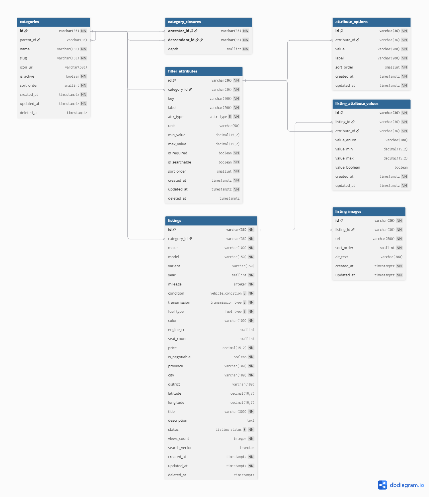

# 🚗 Automotive Marketplace Backend API

A high-performance, enterprise-grade RESTful API for an Automotive Marketplace built with **Node.js (Express)**, **PostgreSQL**, and **Redis**.

Featuring **Closure Table Category Hierarchy**, **Inherited Dynamic Attributes**, **PostgreSQL Full-Text Search (tsvector/GIN)**, **Faceted Navigation / Analytics**, **Dual Pagination (Cursor & Offset)**, and **Redis Cache with Namespace Versioning & Circuit Breaker**.

---

## 📑 Table of Contents
1. [Tech Stack](#-tech-stack)
2. [Prerequisites](#-prerequisites)
3. [Environment Variables](#-environment-variables)
4. [Installation & Setup](#-installation--setup)
5. [Database Setup & Seeding](#-database-setup--seeding)
6. [API Endpoints Overview](#-api-endpoints-overview)
7. [Architectural Decisions & Schema Design Rationale](#-architectural-decisions--schema-design-rationale)
   - [1. Hierarchical Category Closure Table](#1-hierarchical-category-closure-table-category_closures)
   - [2. Hybrid Dynamic Attributes & Inheritance](#2-hybrid-dynamic-attributes--inheritance-filter_attributes--listing_attribute_values)
   - [3. PostgreSQL Full-Text Search Engine](#3-postgresql-full-text-search-engine-tsvector--gin)
   - [4. Dual Pagination Strategy (Cursor vs. Offset)](#4-dual-pagination-strategy-cursor-vs-offset)
   - [5. Redis Cache Strategy & Namespace Versioning](#5-redis-cache-strategy--namespace-versioning)
8. [Testing & Benchmarking](#-testing--benchmarking)

---

## 🛠 Tech Stack

- **Runtime:** Node.js (v18+ or v20+)
- **Framework:** Express.js 5.x
- **Database:** PostgreSQL 14+ (Raw SQL via `pg` Pool for sub-millisecond performance + Sequelize for migrations)
- **Cache & Rate Limiting:** Redis 6+ (`ioredis`, `rate-limit-redis`)
- **Schema Validation:** Zod 4.x
- **Identifier Generation:** CUID (`cuid`)
- **Security:** Helmet, CORS, Express Rate Limit
- **Deployment** Docker

---

## 📋 Prerequisites

Before running the application, ensure you have:
- [Node.js](https://nodejs.org/) (v18.x or higher)
- [PostgreSQL](https://www.postgresql.org/) (v14.x or higher)
- [Redis](https://redis.io/) (v6.x or higher)
- [Docker](https://docs.docker.com/) (newest)

---

## ⚙️ Environment Variables

Create a `.env` file in the project root based on `.env.example`:

```env
# Application
NODE_ENV=development
APP_PORT=8000
PORT=8000

# PostgreSQL Database
DB_CONNECTION=postgresql
DB_HOST=127.0.0.1
DB_PORT=5432
DB_NAME=automotive_marketplace
DB_USER=postgres
DB_PASS=postgres
DB_SSL=false

# Redis Cache & Rate Limiting
REDIS_HOST=127.0.0.1
REDIS_PORT=6379
REDIS_PASSWORD=
REDIS_DB=0

# Security / JWT
JWT_SECRET=your_jwt_secret_key_here
JWT_EXP=1d
```

| Variable | Description | Default |
|---|---|---|
| `PORT` / `APP_PORT` | HTTP Port for the Express server | `8000` |
| `DB_HOST` | PostgreSQL Hostname | `127.0.0.1` |
| `DB_PORT` | PostgreSQL Port | `5432` |
| `DB_NAME` | PostgreSQL Database Name | `automotive_marketplace` |
| `DB_USER` | PostgreSQL Username | `postgres` |
| `DB_PASS` | PostgreSQL Password | `postgres` |
| `REDIS_HOST` | Redis Host | `127.0.0.1` |
| `REDIS_PORT` | Redis Port | `6379` |
| `REDIS_DB` | Redis Database Index | `0` |

---

## 🚀 Installation & Setup

1. **Clone the repository:**
   ```bash
   git clone https://github.com/rayhanzz772/automative-marketplace.git
   cd automative-marketplace
   ```

2. **Install dependencies:**
   ```bash
   npm install
   ```

3. **Configure environment:**
   ```bash
   cp .env.example .env
   # Update your PostgreSQL and Redis credentials in .env
   ```

---

## 🗄️ Database Setup & Seeding

1. **Create PostgreSQL database:**
   ```sql
   CREATE DATABASE automotive_marketplace;
   ```

2. **Run database migrations:**
   ```bash
   npm run migrate
   ```

3. **Seed Category Hierarchy & Base Attributes:**
   ```bash
   npm run seed
   ```

4. **Seed 5,000+ Realistic Automotive Listings:**
   Populates the database with 5,000+ realistic vehicle listings (SUVs, Sedans, EVs, Motorcycles, Trucks) with images, attributes, and Indonesian geographic coordinates:
   ```bash
   npm run seed:bulk
   ```
   *(Optional: You can specify custom amounts, e.g., `node src/scripts/seed-listings.js 10000`)*

5. **Start Development Server:**
   ```bash
   npm run dev
   ```
   Server will be running at `http://localhost:8000`.

6. **Open API Documentation:**
   - Swagger UI: `http://localhost:8000/api/v1/docs`
   - OpenAPI JSON: `http://localhost:8000/api/v1/docs.json`
   - OpenAPI Live: `https://automative.rayhancreative.web.id/api/v1/docs/`

   Swagger UI contains sample requests and responses for every endpoint under the `/api/v1` prefix.

---

## Live Deployment

The application is deployed and available at:

- [https://automative.rayhancreative.web.id/](https://automative.rayhancreative.web.id/)
- API base URL: [https://automative.rayhancreative.web.id/api/v1](https://automative.rayhancreative.web.id/api/v1)
- Live Swagger UI: [https://automative.rayhancreative.web.id/api/v1/docs/](https://automative.rayhancreative.web.id/api/v1/docs/)

---

## 📡 API Endpoints Overview

All responses follow a standard unified envelope:
```json
{
  "success": true,
  "message": "success",
  "metadata": {},
  "data": { ... }
}
```

### 1. Categories (`/categories`)
- `GET /categories` — Get full nested category tree.
- `POST /categories` — Create a root or child category.
- `GET /categories/:id` — Get category details with direct children and breadcrumbs.
- `GET /categories/:id/children` — Get direct child categories (`depth = 1`).
- `GET /categories/:id/filters` — Get all filter attributes applicable to category (including inherited from ancestors).
- `GET /categories/:id/listings` — Browse listings scoped to category and all its descendants.
- `PATCH /categories/:id` — Update category metadata (`name`, `slug`, `icon_url`, `sort_order`, `is_active`).

### 2. Listings (`/listings`)
- `GET /listings` — Browse listings with multi-filters, sorting, and cursor/offset pagination.
  - Query params: `category_id`, `make`, `model`, `condition` (`new`/`used`), `transmission`, `fuel_type`, `city`, `province`, `price_min`, `price_max`, `year_min`, `year_max`, `mileage_min`, `mileage_max`, `sort_by`, `sort_order`, `cursor`, `page`, `per_page`, `attr_<attribute_id>`.
- `POST /listings` — Create a new listing with images and dynamic attributes.
- `GET /listings/:id` — Get listing by ID with images, dynamic attribute values, and category breadcrumbs.
- `PATCH /listings/:id` — Update listing details.
- `DELETE /listings/:id` — Soft-delete listing (`status = 'removed'`, `deleted_at = NOW()`).

### 3. Full-Text Search & Suggestions (`/listings/search`)
- `GET /listings/search` — Full-text search with faceted filtering and relevance scoring (`q`, `category_id`, filters...).
- `GET /listings/search/suggest` — Autocomplete prefix suggestion for search bar (`?q=toy`).

### 4. Facets & Analytics (`/filters`)
- `GET /filters` — Compute facet counts and min/max statistics for all listings or scoped to `category_id`.

---

## 🏛️ Architectural Decisions & Schema Design Rationale

The following ERD represents the database structure and relationships
between vehicle listings, categories, dynamic attributes, and related entities.

<p align="center">
  
</p>

## Category Tree Strategy

### 1. Hierarchical Category Closure Table (`category_closures`)

#### Problem:
Traditional Adjacency Lists (`parent_id`) require expensive recursive CTE queries to traverse deep trees (e.g., retrieving all listings under `Cars` $\rightarrow$ `SUV` $\rightarrow$ `7-Seater SUV`). Materialized Paths (`/cars/suv/7-seater`) make subtree re-parenting and ancestor joins slow and string-bound.

#### Solution:
We implemented the **Closure Table Pattern** with explicit `depth`:
```sql
CREATE TABLE category_closures (
  ancestor_id   VARCHAR(36) NOT NULL REFERENCES categories(id),
  descendant_id VARCHAR(36) NOT NULL REFERENCES categories(id),
  depth         INTEGER NOT NULL,
  PRIMARY KEY (ancestor_id, descendant_id)
);
```

Every category has a self-reference row with `depth = 0`. A category also has one row for each ancestor: a direct parent has depth `1`, its grandparent has depth `2`, and so on. For example, the following tree produces these closure rows:

```text
Cars
└── SUVs
      └── 7-Seater SUV

(Cars, Cars, 0)
(Cars, SUVs, 1)
(Cars, 7-Seater SUV, 2)
(SUVs, SUVs, 0)
(SUVs, 7-Seater SUV, 1)
(7-Seater SUV, 7-Seater SUV, 0)
```

When a category is created, the application inserts its self-row and copies the new parent's ancestor rows with `depth + 1`, in the same transaction as the category insert. The primary key prevents duplicate relationships and keeps the closure table idempotent. Category deletion cascades its closure rows, while the category's `parent_id` uses `ON DELETE RESTRICT` to prevent deleting a parent that still owns children.

#### Key Advantages:
- **Indexed subtree filtering:** Fetching descendant IDs under an ancestor requires one indexed lookup instead of a recursive query. The database still spends time proportional to the number of descendants returned, but traversal depth does not add recursive query work:
  ```sql
  WHERE l.category_id IN (
    SELECT descendant_id FROM category_closures WHERE ancestor_id = $1
  )
  ```
- **Indexed breadcrumbs:** Fetching all ancestors for a category is a single join through `descendant_id`, ordered by `depth DESC` so the root appears first and the current category appears last.
- **Direct-child queries:** Direct children are selected with `ancestor_id = $1 AND depth = 1`, avoiding a recursive expansion when rendering one level of the tree.
- **Inherited category behavior:** The same ancestor relationship supports inherited filters. Attributes defined on a parent can be joined to every descendant without copying attribute definitions to each category.
- **Predictable reads:** Listing browse, category detail, breadcrumb, and filter-inheritance queries all use the same normalized relationship model.

#### Write and Read Trade-off:
Closure tables duplicate relationships rather than category records. A deep or frequently re-parented tree therefore has a higher write cost: inserting or moving a node requires updating all affected ancestor/descendant pairs. That trade-off is intentional for this marketplace because category browsing, breadcrumbs, descendant listing searches, and inherited filters are read-heavy operations. The current API creates categories under an existing parent but does not expose a re-parent operation, which keeps closure maintenance small and transactional.

#### Integrity Rules:
- `depth = 0` must exist for every category.
- `ancestor_id = descendant_id` is valid only for a self-row.
- Every ancestor path must have exactly one `(ancestor_id, descendant_id)` pair.
- Soft-deleted categories are excluded from API reads, while closure rows remain available for referential consistency until the category is physically removed.

---

## Indexing Strategy

Indexes are designed around the application's actual predicates: active/non-deleted records, category subtree membership, typed attribute filters, sorting, and full-text search. Indexes improve candidate-row lookup, but they do not eliminate the cost of sorting, counting, joins, or returning large result sets. Query plans should be checked with `EXPLAIN (ANALYZE, BUFFERS)` after significant data-volume changes.

### Category and Closure Indexes

The category tables use indexes that match both navigation and visibility rules:

| Index | Purpose |
|---|---|
| `uniq_categories_slug` (partial unique) | Enforces unique slugs for non-deleted categories while allowing a soft-deleted row's slug to be reused. |
| `idx_categories_parent_id` (partial) | Finds direct children quickly when building or validating tree navigation. |
| `idx_categories_is_active` (partial) | Finds active, non-deleted categories without scanning inactive rows. |
| `PRIMARY KEY (ancestor_id, descendant_id)` | Prevents duplicate closure relationships and supports ancestor-to-descendant lookup. |
| `idx_closure_ancestor_depth` | Supports descendant expansion and `depth = 1` direct-child queries. |
| `idx_closure_descendant_depth` | Supports breadcrumb and ancestor lookups ordered by depth. |

Partial indexes intentionally include `deleted_at IS NULL` or active-row predicates where appropriate. This keeps indexes smaller and aligns their entries with the API's default visibility rules.

### Listing Lookup and Sorting Indexes

The listings table combines single-column indexes with indexes for common marketplace browse paths:

| Index | Query pattern |
|---|---|
| `idx_listings_category_id` | Joins listing rows to a selected category or its closure-derived descendants. |
| `idx_listings_make`, `idx_listings_year`, `idx_listings_price`, `idx_listings_mileage` | Case-sensitive exact and range access paths for the corresponding columns. |
| `idx_listings_make_lower`, `idx_listings_city_lower`, `idx_listings_province_lower` (partial functional) | Supports the API's `LOWER(column) = LOWER($1)` filters while excluding soft-deleted rows. |
| `idx_listings_model_lower_trgm` (partial GIN) | Supports case-insensitive substring searches using `LOWER(model) LIKE LOWER('%term%')`. Requires PostgreSQL `pg_trgm`. |
| `idx_listings_fuel_type`, `idx_listings_transmission`, `idx_listings_city` | Common categorical filters and legacy case-sensitive access paths. The case-insensitive city path uses `idx_listings_city_lower`. |
| `idx_listings_status_active` (partial) | Keeps the default `status = 'available' AND deleted_at IS NULL` path small. |
| `idx_listings_composite` (partial) | Supports active listing reads filtered by `status` and `category_id`, with price/year ordering or range constraints. |

The API uses a stable secondary sort on `id` after the selected sort column. This makes cursor pagination deterministic when multiple listings share the same price, year, mileage, or timestamp. The functional indexes are required because wrapping a column in `LOWER()` prevents PostgreSQL from using a normal index on the original column for the same predicate. The available indexes help narrow the candidate set, but high-cardinality combinations of optional filters are deliberately handled by PostgreSQL's planner instead of creating an index for every possible URL.

### Full-Text Search Index

`search_vector` is maintained by a `BEFORE INSERT OR UPDATE` trigger. It combines weighted `simple` text vectors so identifiers and titles rank above location and description text:

```text
Weight A: title, make, model, variant
Weight B: city, province
Weight C: description
```

The GIN index `idx_listings_search_vector` accelerates the `search_vector @@ tsquery` match step. PostgreSQL still calculates `ts_rank` and sorts matching rows, so relevance searches can cost more than a normal indexed browse when a broad term matches many listings. This is why search result limits, selective filters, and benchmark queries matter.

### 2. Hybrid Dynamic Attributes & Inheritance (`filter_attributes` & `listing_attribute_values`)

#### Problem:
Different vehicle categories require different technical attributes (e.g., EV requires *Battery Capacity (kWh)* & *Electric Range (km)*; SUV requires *Drive Type (4WD/AWD)*; Motorcycles require *Cooling System*). Storing these in a single wide SQL table causes schema bloat; storing in pure JSONB loses strict SQL data types, range indexing, and foreign key integrity.

#### Solution:
We designed a **Hybrid EAV with Typed Columns**:
```sql
CREATE TABLE listing_attribute_values (
  id            VARCHAR(36) PRIMARY KEY,
  listing_id    VARCHAR(36) NOT NULL REFERENCES listings(id) ON DELETE CASCADE,
  attribute_id  VARCHAR(36) NOT NULL REFERENCES filter_attributes(id) ON DELETE CASCADE,
  value_enum    VARCHAR(200),  -- for attr_type = 'enum'
  value_min     DECIMAL(15,2), -- for attr_type = 'range' lower bound
  value_max     DECIMAL(15,2), -- for attr_type = 'range' upper bound
  value_boolean BOOLEAN,       -- for attr_type = 'boolean'
  CONSTRAINT uniq_lav_listing_attr UNIQUE (listing_id, attribute_id)
);
```

#### Partial Indexes for Maximum Filter Performance:
```sql
CREATE INDEX idx_lav_attr_enum    ON listing_attribute_values(attribute_id, value_enum)    WHERE value_enum IS NOT NULL;
CREATE INDEX idx_lav_attr_range   ON listing_attribute_values(attribute_id, value_min, value_max) WHERE value_min IS NOT NULL;
CREATE INDEX idx_lav_attr_boolean ON listing_attribute_values(attribute_id, value_boolean) WHERE value_boolean IS NOT NULL;
```

These indexes correspond directly to the `EXISTS` predicates used by listing filters. `attribute_id` is the leading column because every request filters one specific attribute before comparing its value. The partial predicates avoid indexing rows that cannot participate in that value type's lookup. Range filters use `value_min` and optionally `value_max` to support values contained within a stored interval; the unique `(listing_id, attribute_id)` constraint guarantees one value per attribute on each listing.

#### Attribute Inheritance:
When querying filters for a category (`GET /categories/:id/filters`), closure joins allow subcategories to automatically inherit attributes defined in ancestor categories without duplicating schema rows.

### Index Maintenance and Validation

Indexes increase insert/update cost and consume storage, so each index exists to serve a known predicate or ordering rule. After bulk seeding or production growth, validate the assumptions with:

```sql
EXPLAIN (ANALYZE, BUFFERS)
SELECT descendant_id
FROM category_closures
WHERE ancestor_id = $1;

EXPLAIN (ANALYZE, BUFFERS)
SELECT id, title, price
FROM listings
WHERE status = 'available'
   AND deleted_at IS NULL
ORDER BY price ASC, id ASC
LIMIT 20;
```

The benchmark should be repeated with representative category sizes and search terms. A query may correctly use an index for filtering and still spend most of its time on ranking, sorting, aggregation, or fetching related images.

---

### 3. PostgreSQL Full-Text Search Engine (`tsvector` + GIN)

Instead of introducing heavyweight external search infrastructure (such as Elasticsearch) for moderate scale, we leveraged PostgreSQL native Full-Text Search with a dedicated `search_vector` column and **GIN Index**.

#### Weighted Relevance Scoring Trigger:
A PostgreSQL trigger auto-maintains search vectors on every `INSERT` or `UPDATE`:
- **Weight A (Highest):** `title`, `make`, `model`, `variant`
- **Weight B (Medium):** `city`, `province`
- **Weight C (Body):** `description`

```sql
CREATE INDEX idx_listings_search_vector ON listings USING GIN(search_vector);
```

Query execution uses `ts_rank(search_vector, plainto_tsquery('simple', $1))` to return listings ordered by semantic relevance.

---

### 4. Dual Pagination Strategy (Cursor vs. Offset)

The application supports both pagination paradigms tailored for different client UI needs:

1. **Cursor-Based Pagination (Infinite Scroll & Mobile Feeds):**
   - Encodes `{ id, sortValue }` into an opaque Base64 cursor string.
   - Avoids the $O(N)$ scanning penalty of high `OFFSET` values (`OFFSET 100000`).
   - Prevents duplicate/missed listings when new items are added while browsing.
   - Returns `next_cursor` and `has_more` in metadata.

2. **Offset-Based Pagination (Desktop & Admin Portals):**
   - Standard `page` and `per_page` query parameters.
   - Returns total row count and total pages.

---

### 5. Redis Cache Strategy & Namespace Versioning

Caching search and filtered results is notoriously challenging because query parameter combinations are practically infinite.

#### A. Stable Parameter Hashing (`buildCacheKey`):
Deeply sorts parameter keys and hashes them with SHA-1 (16 chars) to guarantee that `?make=Toyota&city=Jakarta` and `?city=Jakarta&make=Toyota` always map to the exact same cache key:
```
search:listings:listings1:3f9a71bc820de456
```

#### B. Zero-Downtime Namespace Version Invalidation (`invalidate`):
Rather than performing dangerous, blocking `KEYS *` or slow pattern scans across Redis, we use **Namespace Versioning**:
1. When generating keys, the current namespace version is embedded (e.g. `ver:listings = 1` $\rightarrow$ `listings1`).
2. When a listing is created, updated, or deleted, we simply call `redis.incr('ver:listings')`.
3. All subsequent reads immediately point to `listings2`. Old keys expire naturally via their TTL, achieving **$O(1)$ instantaneous cache invalidation**.

#### C. Built-in Circuit Breaker & Timeout Resilience:
- Cache reads/writes are wrapped with a **250ms timeout**.
- If Redis fails or hangs, a **Circuit Breaker** trips for a 5-second cooldown (`BREAKER_COOLDOWN_MS`).
- The application automatically degrades gracefully, executing PostgreSQL queries directly without crashing or adding latency to incoming user requests.

---

## 🧪 Testing & Benchmarking

Run the bulk seed script to test database performance under heavy loads:
```bash
# Seed 5,000 listings
npm run seed:bulk

# Benchmark Search & Facets via cURL
curl "http://localhost:8000/listings/search?q=fortuner&condition=used&sort_by=price&sort_order=ASC"
curl "http://localhost:8000/filters"
```

### Database Query Benchmark

Run PostgreSQL execution-plan benchmarks for the main listing workflows:

```bash
npm run benchmark:queries
```

The benchmark runs `EXPLAIN (ANALYZE, BUFFERS)` against:

- Search count using PostgreSQL full-text search.
- Search results with relevance ranking and primary image lookup.
- Normal listing browse with sorting and primary image lookup.
- Dynamic facet aggregation.

Example results with approximately 30,000 listings and a warm PostgreSQL cache:

| Query | Execution time |
|---|---:|
| Search count | ~11 ms |
| Search with ranking and image | ~262 ms |
| Normal listing browse | ~23 ms |
| Dynamic facets | ~73 ms |

The full-text search query is the main database bottleneck because PostgreSQL ranks and sorts thousands of matching rows before returning the first page. Dynamic facets are the second-largest cost because they aggregate and join listing attribute values. Actual results depend on hardware, database cache state, query parameters, and concurrent traffic. For production evaluation, repeat the benchmark under concurrent load and monitor p95/p99 latency.

---

## 📄 License

This project is licensed under the **MIT License**.
